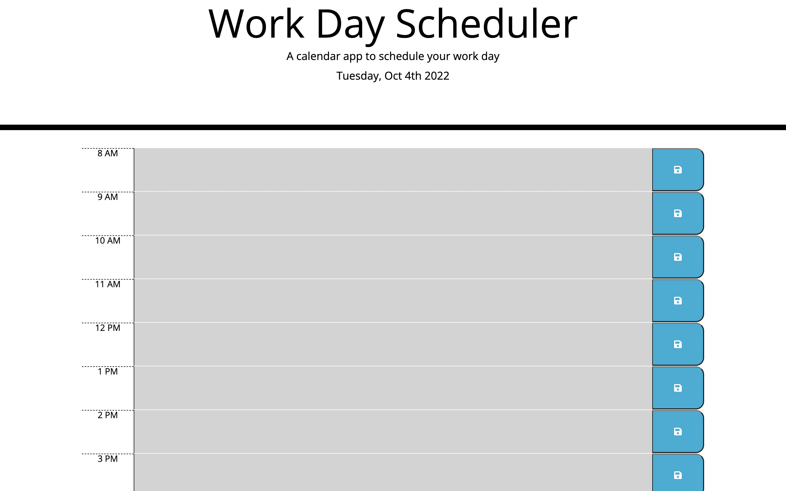

# Modification of starter code to create workday scheduler

## Description
The goal of this project was to supplement the provided starter code with additional code to create a workday scheduler from 8 AM to 5 PM. The HTML, CSS, and JavaScript files were created and/or modified to generate a scheduler that can receive and save text info for each hour. Additionally, the scheduler also categorizes each hour between 8 AM to 5 PM as past, present, or future; there are separate colors to denote each of these time categories.

## Table of Contents
N/A

## Installation
N/A

## Usage
Website: https://mvasireddy2022.github.io/Workday-Scheduler/

## License
MIT License